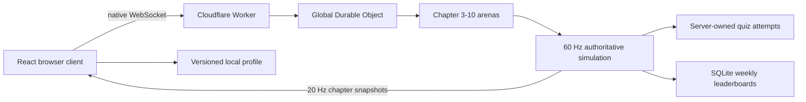

# Neon Snake architecture

This document describes the implementation after the authoritative multiplayer cutover.
Remaining product work is tracked in [TECHNICAL_PLAN.md](./TECHNICAL_PLAN.md).

## System overview

Neon Snake is a chapter-based multiplayer game hosted by Cloudflare Static Assets and one globally
named SQLite-backed Durable Object. The browser sends sequenced steering transitions and renders
authoritative snapshots. The Durable Object owns movement,
orb collection, score, length, quiz milestones, quiz effects, internal hazards, collision deaths,
and run completion.

The deployed game does not call OpenAI. A future offline authoring command will use
`OPENAI_API_KEY` to create review drafts; only approved question files may enter runtime.

## Runtime ownership

### Browser

- Stores the anonymous profile, display name, preferred chapter, mastery, streaks, and local
  statistics in versioned `localStorage`.
- Sends `join`, sequenced input transitions, `submit_answer`, and `continue_after_quiz` commands.
- Requests the selected chapter leaderboard before joining so the lobby can show weekly scores
  alongside the locally stored personal best.
- Receives chapter-scoped snapshots and interpolates snake positions for rendering.
- Updates local learning progress only from server quiz and run results.
- Never reports positions, scores, pickups, quiz eligibility, or death.

### Cloudflare Worker and Durable Object

- Maintains one in-memory arena for each occupied chapter.
- Simulates movement at 60 Hz and broadcasts snapshots at 20 Hz.
- Resolves contested orb pickups once and triggers a quiz every ten confirmed pickups.
- Starts from the client's coarse mastery band, adapts difficulty from validated answers, avoids
  repeats until the chapter bank is cycled, and shuffles answer presentation per attempt.
- Caps body length at 100 while allowing score to continue.
- Ignores collisions with other snakes and treats walls as non-lethal boundaries.
- Activates deterministic chapter hazards arena-wide when a player reaches seven collected orbs,
  while enforcing activation, join, and post-quiz grace periods.
- Detects self-collision at 15 or more segments and head collisions with active internal hazards,
  then finalizes the run exactly once.
- Validates and rate-limits native WebSocket payloads.
- Stops fixed-step timers when no active run remains; client input is sent only when controls change.
- Stores only weekly best scores in Durable Object SQLite after a server-detected gameplay death.
- Forces clients through a clean reconnect if an in-memory run is interrupted by an object restart
  instead of fabricating partial replacement state.

## Repository map

| Path | Responsibility |
| --- | --- |
| `src/cloudflare/worker.ts` | Worker routing, Durable Object WebSockets, game loops, SQLite leaderboards, and lifecycle. |
| `wrangler.jsonc` | Static asset routing, Durable Object binding, and SQLite class migration. |
| `src/server/arena/ArenaManager.ts` | Chapter-room state, joins, input routing, snapshots, quiz attempts, and tick outcomes. |
| `src/server/game/` | Pure movement, collision, scoring, and simulation rules. |
| `src/server/socket/` | Shared rate limiter plus retained legacy Socket.IO handlers and migration tests. |
| `src/server/db/` | Shared weekly UTC clock plus retained legacy Node SQLite setup. |
| `src/server/repositories/` | Retained legacy Node weekly-score adapter and persistence tests. |
| `src/server/questions/` | Approved-bank loading, adaptive selection, no-repeat tracking, answer shuffling, and grading. |
| `src/shared/protocol.ts` | Typed client/server events and sanitized payloads. |
| `src/shared/questionSchema.ts` | Versioned approved/draft question contract and answer redaction. |
| `src/profile/` | Local profile parsing, migration, persistence, and progress updates. |
| `src/client/realtime/` | Typed native WebSocket adapter with bounded reconnect backoff. |
| `src/store/gameStore.ts` | Authoritative snapshots, profile updates, leaderboard, and quiz UI state. |
| `src/components/GameScene.tsx` | Input capture, snapshot interpolation, camera, and Three.js rendering. |
| `src/components/UI.tsx` | Join/death overlay, HUD, weekly leaderboard, and explicit quiz feedback. |

## Realtime protocol

| Direction | Event | Authority |
| --- | --- | --- |
| Client → server | `join` | Validated UUID, sanitized name, and Chapter 3–10 selection. |
| Client → server | `request_leaderboard` | Validated Chapter 3–10 request; allowed before joining. |
| Client → server | `input` | Increasing sequence and three boolean controls only. |
| Client → server | `submit_answer` | Must match the server-issued active attempt. |
| Client → server | `continue_after_quiz` | Accepted only after an answer has been scored. |
| Server → client | `init` | Identifies the player and joined chapter. |
| Server → room | `snapshot` | Sanitized authoritative players, orbs, hazard state, and hazard locations for one chapter. |
| Server → client | `trigger_quiz` | Contains no answer or feedback fields. |
| Server → client | `quiz_result` | Answer, explanation, source, and applied deltas. |
| Server → client | `run_ended` | Server-validated self-collision or hazard-collision summary. |
| Server → room | `leaderboard` | Weekly chapter top ten. |

The removed legacy events `update_state` and `collect_orb` have no server handlers.

## Persistence and privacy

Durable Object SQLite stores one row per week/chapter/profile hash. Monday 00:00 UTC starts a new
leaderboard week. A lower score cannot
replace an existing weekly best. Disconnects abandon runs and do not write leaderboard rows.

The raw browser UUID and learning history are not stored in the database. With no authentication,
a copied UUID can still impersonate a browser identity; this limitation is explicit.

## Configuration and health

Cloudflare configuration lives in `wrangler.jsonc`. `ALLOWED_ORIGINS` is an optional comma-separated
Worker variable for additional browser origins; the deployed same origin is always allowed. Native
WebSocket payloads are capped at 16 KiB.

- `GET /api/health/live`: Worker liveness.
- `GET /api/health/ready`: Worker readiness.
- `GET /api/health`: compatibility status.

Durable Object socket-close handlers remove players and stop the simulation when the final active run
ends. Leaderboard data survives Worker deploys in Durable Object SQLite; live runs intentionally do
not survive an object restart.

## Current limitations

- Adaptive difficulty uses five coarse mastery bands and one-step correct/incorrect adjustments;
  it is intentionally simpler than a calibrated assessment model.
- Local movement prediction is not implemented; rendering interpolates server snapshots.
- Snapshots still contain the complete chapter arena; delta replication is deferred.
- One global Durable Object is intentionally the only simulation authority. Future scale-out would
  shard by classroom or chapter and requires an explicit cross-room leaderboard design.
- A live run is in-memory and restarts at the lobby after a Durable Object restart or deployment.
- The first Cloudflare staging deployment and classroom-sized usage observation are still pending.
- The client bundle still triggers Vite's 500 KiB chunk warning.
