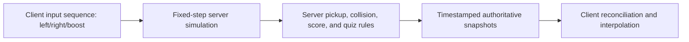

# Neon Snake improvement review

> Historical review: the server-authority, typed protocol, validation, test, resource-cap, and
> SQLite leaderboard recommendations are now substantially implemented. See
> [ARCHITECTURE.md](./ARCHITECTURE.md) and [TECHNICAL_PLAN.md](./TECHNICAL_PLAN.md) for current state.

This review is based on the current source and local verification, not on inferred product requirements. Recommendations are ordered by impact and dependency: fix the trust boundary first, then reduce realtime cost, then improve correctness and delivery discipline.

## Executive summary

The project is a focused prototype with a sensible visual/UI split, shared domain types, efficient instanced rendering, client prediction for responsive movement, and server-side quiz answer checking. Its main limitation is architectural: clients are trusted to report authoritative positions, scores, collisions, deaths, quiz eligibility, and orb pickups. That makes cheating trivial and causes race conditions even among honest clients. The full-state 60 Hz broadcast and full-snake 20 Hz uploads will also become expensive quickly as player length or concurrency grows.

The production build succeeds, but the typecheck currently fails. No automated tests exist. The generated JavaScript is 1.33 MB minified (377 KB gzip), and Vite reports a chunk-size warning.

## Priority roadmap

| Priority | Improvement | Why it matters | Suggested first increment |
| --- | --- | --- | --- |
| P0 | Make gameplay server-authoritative | Prevents arbitrary scores/positions, remote orb deletion, fake quiz entry, and collision disagreement. | Replace `update_state` snapshots with input messages; simulate movement, pickups, collisions, and quiz counters on the server. |
| P0 | Validate and limit every socket payload | Unbounded segment arrays and unchecked values can corrupt state or consume memory/bandwidth. | Define schemas, reject invalid/non-finite/out-of-range values, cap payload size and event frequency. |
| P1 | Redesign state replication | Full world broadcasts at 60 Hz and full segment uploads at 20 Hz scale poorly. | Send compact snapshots at 10-20 Hz, inputs at a fixed rate, and interpolate between snapshots; send orb spawn/remove deltas. |
| P1 | Restore a green quality gate | `npm run lint` fails today, while `npm run build` still exits successfully. | Fix the two type errors and make CI run typecheck before build. |
| P1 | Add protocol and gameplay tests | Realtime state transitions currently have no regression protection. | Extract pure simulation functions and test join, movement, pickup races, collision, quiz, death, and disconnect. |
| P1 | Harden production serving/configuration | Fixed port, wildcard CORS, no SPA fallback, and no graceful shutdown complicate deployment. | Read `PORT`, constrain origins, add an index fallback, handle startup/shutdown errors, and document the deploy command. |
| P2 | Bound resource usage | Forced orb drops bypass `MAX_ORBS`; rendering and network costs can exceed assumed limits. | Enforce one cap for all spawn paths and cap snake length/player count. |
| P2 | Reduce client bundle and dependencies | The bundle triggers Vite's 500 KB warning and several direct dependencies are unused. | Remove unused packages and lazy-load the 3D/game route or split large vendor chunks. |
| P2 | Clarify state and protocol types | `any`, unused fields/states, and type-only imports make the contract easier to break. | Add shared typed event maps and explicit command/snapshot types; remove dead fields. |
| P3 | Improve product accessibility and resilience | Keyboard-only play and silent connection failures limit usability. | Add touch/pointer controls, focus management, reduced-motion options, and reconnect/error UI. |

## Findings and recommendations

### 1. Move authority to the server (P0)

Evidence:

- `GameScene.tsx` calculates movement, score changes, orb collisions, player collisions, death, and quiz eligibility.
- `update_state` lets a client replace its complete segment array, score, angle, and boost state.
- `collect_orb` deletes any existing orb ID without checking player proximity or eligibility.
- A client can request `state: "quiz"` at any time; the server does not verify ten pickups.

Consequences include deliberate cheating, honest-client pickup races where more than one player rewards itself for one orb, impossible movement, arbitrarily large scores/segments, and inconsistent collision outcomes.

Recommended target model:

Keep client prediction for responsiveness, but treat it as presentation. The client sends input state plus a monotonically increasing sequence number. The server advances all players on a fixed timestep, resolves pickups/collisions once, and returns the last processed input sequence with snapshots. The local client replays unacknowledged inputs after reconciling to the authoritative position.

This change also lets the server own `dotsEaten`, so quiz entry becomes enforceable.

### 2. Add runtime schemas, limits, and abuse controls (P0)

TypeScript annotations disappear at runtime. Validate every inbound event with a schema library or narrow custom validators:

- Require finite numeric values and known enum values.
- Constrain answer index and question ID.
- Until snapshots are removed, cap segment count and validate every coordinate.
- Enforce maximum event rate per socket and maximum concurrent players.
- Reject duplicate/invalid lifecycle transitions.
- Apply Socket.IO's transport/payload limits and record rejected events.

Use typed Socket.IO event maps on both client and server so event names and payloads cannot drift at compile time.

### 3. Reduce replication cost (P1)

Current cost grows with both player count and snake length:

- Each client uploads its complete segment array about 20 times per second.
- The server serializes and broadcasts all players, all segments, and all orbs 60 times per second.
- Every client receives the same complete arena, regardless of camera visibility.

Recommended sequence:

1. Lower authoritative snapshot frequency to roughly 10-20 Hz while retaining render-frame interpolation.
2. Send inputs rather than segments from clients.
3. Represent orb changes as spawn/remove events plus occasional recovery snapshots.
4. Quantize coordinates and use compact arrays or a binary codec if JSON remains material in profiling.
5. Add areas of interest/spatial partitioning only when measured concurrency warrants it.

Measure serialized bytes per second, event-loop delay, tick duration, connected players, and dropped/late input before choosing further optimizations.

### 4. Fix the current typecheck and make it a release gate (P1)

`npm run lint` currently reports:

- `src/components/UI.tsx`: `import.meta.env` is not typed because Vite client types are absent.
- `src/components/UI.tsx`: `sendPlayerState` is used by the development quiz button but is not selected from `useGameStore`.

Add `vite/client` to the TypeScript environment (commonly via `src/vite-env.d.ts`) and select `sendPlayerState` from the store, or move the developer action behind a typed debug API. Consider renaming the script to `typecheck` and adding a real ESLint configuration if linting is desired.

Make the release command run, in order: typecheck, tests, production build. Vite transpiles TypeScript without typechecking, which is why the current build succeeds despite these errors.

### 5. Extract and test domain behavior (P1)

There are no tests or test framework. Start by moving mutable rules out of Socket.IO callbacks and React `useFrame` into deterministic functions:

- player creation and legal state transitions;
- fixed-step movement and boundary policy;
- segment following/growth;
- orb spawning and single-winner pickup resolution;
- player collision resolution;
- quiz selection, answer scoring, and boost expiry;
- death/disconnect drops and caps;
- leaderboard derivation.

Use a seeded or injected random-number generator and a fake clock. Unit-test pure rules, then add Socket.IO integration tests with two clients to cover pickup contention, malformed events, reconnect/respawn, quiz completion, and disconnect cleanup. A browser smoke test should cover join, movement, quiz display, and death/respawn.

### 6. Harden server lifecycle and production delivery (P1)

Recommended changes:

- Read `PORT` and allowed origins from validated environment configuration.
- Replace wildcard CORS in production with known origins.
- Add a production SPA fallback to `dist/index.html` for non-API routes.
- Resolve static paths relative to the module rather than the process working directory.
- Check and report `startServer()` rejection; handle HTTP server errors.
- Stop accepting connections, clear the tick interval, and close HTTP/Socket.IO cleanly on `SIGTERM`/`SIGINT`.
- Distinguish readiness from liveness. Readiness should fail during shutdown or failed initialization.
- Document a real production command. `vite preview` serves the client bundle but does not run the multiplayer server.

For horizontal scaling, first decide whether each URL represents one arena/room or whether players must share one global arena. Multiple replicas require sticky routing plus a Socket.IO adapter and shared/partitioned simulation ownership; simply adding Redis pub/sub does not make independently simulated state authoritative.

### 7. Enforce resource invariants (P2)

`spawnOrb(..., force = true)` bypasses `MAX_ORBS` for boost trails, deaths, and disconnects. A long snake or many disconnects can grow state beyond the intended cap. The renderer reserves 1,000 orb instances although the normal server cap is 300, and each snake reserves 2,000 segment instances without enforcing a gameplay maximum.

Use a single hard cap on all orb creation paths, define a maximum snake length, and decide how excess death drops are sampled. Bound player count and question attempts as well. Assert these invariants in tests and expose current counts as metrics.

### 8. Simplify dependencies and configuration (P2)

The following direct runtime dependencies appear unused by source imports: `@geckos.io/client`, `@geckos.io/server`, `@google/genai`, `better-sqlite3`, `dotenv`, and the standalone `motion` package. Remove them after confirming no planned or generated workflow depends on them. `Player` in `gameStore.ts` and several server imports are also unused.

`.env.example` and the README currently frame the app as Gemini-powered, but there is no AI API call. Remove the unused key or clearly label it as future functionality. Avoid defining secret-like server environment variables in Vite client configuration: any referenced compile-time value becomes public in the browser bundle.

The production client is currently 1.33 MB minified (377 KB gzip). Profile the bundle before changing it. Likely options are removing unused packages, lazy-loading the game scene/post-processing, and deliberately splitting Three.js-related code. Set performance budgets in CI so growth is visible.

### 9. Strengthen state ownership and types (P2)

Current code mutates `globalGameState.current`, including deleting orbs and overwriting the local player's server snapshot. This is fast but makes server state, predicted state, and UI state difficult to distinguish. Use explicit structures:

- `authoritativeSnapshot`: immutable latest server snapshot;
- `predictedLocalPlayer`: mutable render/simulation state;
- `presentationState`: interpolated remote entities;
- `uiState`: connection, menu, and quiz state.

Replace `sendPlayerState(data: any)` and `segments: any[]` with named command/snapshot types. Use `import type` for type-only imports. Remove or implement `Player.inputs`, `spectating`, `ORB_SPAWN_RATE`, and unused server imports/constants. Split the 450-line `GameScene.tsx` into input, prediction, collision, camera, snake rendering, and orb rendering modules as those responsibilities evolve.

### 10. Improve connection UX, controls, and accessibility (P3)

The UI treats “not yet initialized,” disconnected, and ready-to-join similarly. Track Socket.IO connection, reconnect, and server error states; disable play until connected and show recoverable failures. Make `connect()` return or expose cleanup so app remounts/hot reload do not leave unmanaged listeners.

Add touch/pointer controls for mobile, prevent gameplay keys from scrolling the page, and pause input while quiz controls are focused. Provide visible keyboard focus, modal semantics/focus trapping, screen-reader status announcements, and a reduced-motion/post-processing option. Use dynamic viewport units for mobile browser chrome and test GPU fallback behavior.

## What is already working well

- Shared game types and constants provide a useful starting boundary between client and server.
- The HTML UI and Three.js scene are separated cleanly in `App.tsx`.
- A mutable high-frequency render snapshot plus throttled Zustand updates avoids forcing React to render at the server tick rate.
- Instanced meshes are appropriate for repeated snake segments and orbs.
- Remote-player interpolation and local prediction improve perceived responsiveness.
- The correct quiz answer remains server-checked and is omitted from the initial quiz payload.
- The health endpoint and same-process development server make the prototype easy to start.

## Suggested delivery phases

### Phase 1: establish safety and confidence

Fix typecheck, add shared event types and runtime validation, cap payloads/resources, extract pure rule functions, and add tests around the current behavior. Add basic connection/error UI and deployment configuration.

### Phase 2: change the authority model

Move movement, orb pickups, score, collision, death, and quiz eligibility to a fixed-step server simulation. Introduce input sequence numbers, reconciliation, and snapshot interpolation. Load-test realistic snake lengths and concurrent clients.

### Phase 3: optimize and operate

Introduce delta replication, rooms/arena partitioning, metrics, structured logs, graceful lifecycle handling, and horizontal-scaling infrastructure only as measured demand requires. Reduce the client bundle and add full browser accessibility/mobile coverage.

## Verification snapshot

Run on 2026-08-11 with the installed dependencies and Node.js 22.16.0:

| Check | Result |
| --- | --- |
| `npm run lint` (`tsc --noEmit`) | Failed with the two `UI.tsx` errors described above. |
| `npm run build` | Passed; Vite processed 2,680 modules. |
| Production client size | JavaScript: 1,333.59 KB minified / 377.02 KB gzip; CSS: 25.32 KB / 5.18 KB gzip. |
| Server smoke test | Not completed in the review sandbox because local socket binding was denied (`EPERM`); this is an environment limitation, not evidence of an application failure. |
| Automated tests | None configured. |
